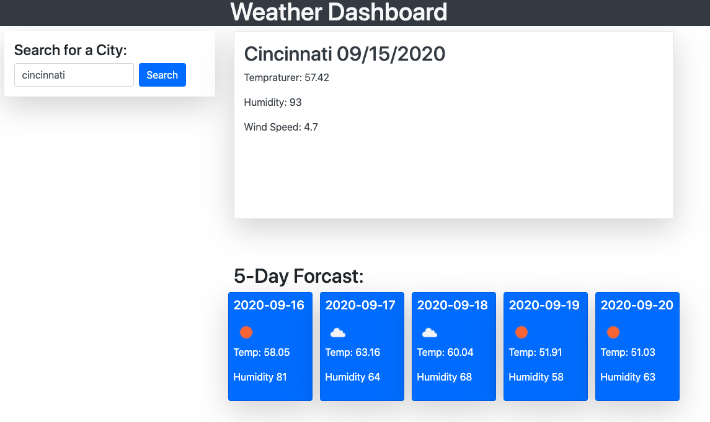

# hw-6-weatherApp-jrl

## Ye Old Weather Dashboard

##### DISCLAIMER

with MVP in mind the app should load for you and you should be able to search your current city forecast, I still have some bugs to work out but needs to be submitted now, so I've lost UV index and listing my previous searches and appending to the page but the functionality should operate 1 search at a time for now. I will push changes as I block time to come back to this project.

### Assignment

This application is a simple 5 day outlook and current weather for a city you choose. Simply type the city and search, the current weather is displayed along with a UV index score. Upon search and reload of the page the previous cities will remain listed with local storage. The page had been for the most part dynamically generated with click events, which starts the API calls using ajax.

### Development and Technologies utilized

With this application and my last I began using the sandbox a ton to play around in, this has been a tremendous help to try and get a process of building these applications with MVP in mind.
-Github hosts my repo
-Git is the verseion control
-CSS to style the container
-HTML created DOM elements with
-javascrip dynamically change the html on the DOM
-Bootstrap responsive and organized structure
-local storage to display saved data that is searched, called for then presented on page
-momentjs"an attempt anyways" to pull current dat for current city

### Thanks

-Special thanks to openweathermap their API is one of the better organized API's I've looked at.
The documentation is very much user friendly unlike most API's i've found.
-Youtube-Brad Traversy
-Classmates who are great with sharing there issues that helps me out tremendously.
-Thanks to our instructional staff who does a great job in the short amount of time we have together.

### Screenshots

#### Built Using

- [API](https://openweathermap.org/api)
- [jQuery](https://api.jquery.com/)
- [HTML](https://developer.mozilla.org/en-US/docs/Web/HTML)
- [CSS](https://developer.mozilla.org/en-US/docs/Web/CSS)
- [Boostrap](https://getbootstrap.com/)
